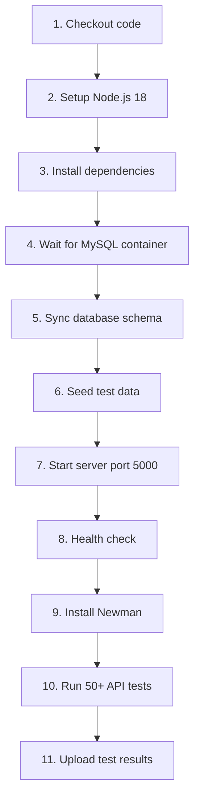

# 🤖 GITHUB ACTIONS CI/CD - TÓM TẮT

## ✅ HIỆN TRẠNG

### Workflow đã có
- **File**: `.github/workflows/api-tests.yml`
- **Tên**: 🧪 API Tests
- **Trigger**: Push (main/develop), Pull Request, Manual
- **Status**: ✅ READY TO USE

### Đã test chưa?
Chạy lệnh này để verify:
```powershell
# Mở GitHub Actions
start https://github.com/Sy-Thien/tclinic_nhom3/actions
```

---

## 🎯 WORKFLOW LÀM GÌ?

### Các bước tự động (11 steps):



**Thời gian**: ~3 phút  
**Kết quả**: Test report HTML + JSON

---

## 🚀 CÁCH CHẠY (3 OPTIONS)

### Option 1: Trigger thủ công (Cho demo)

1. Mở: https://github.com/Sy-Thien/tclinic_nhom3
2. Tab **Actions**
3. Click workflow **"🧪 API Tests"** (bên trái)
4. Click nút **"Run workflow"** (bên phải)
5. Chọn branch: **main**
6. Click **"Run workflow"** (xanh)
7. Đợi 2-3 phút
8. Xem kết quả: ✅ hoặc ❌

### Option 2: Push code (Tự động)

```powershell
git add .
git commit -m "test: trigger CI workflow"
git push origin main
```
→ Workflow tự động chạy sau vài giây

### Option 3: Pull Request (Tự động)

1. Tạo branch mới: `git checkout -b feature/xyz`
2. Push: `git push origin feature/xyz`
3. Tạo PR trên GitHub
4. Workflow tự động chạy để verify code

---

## 📊 XEM KẾT QUẢ

### Trong GitHub

1. Vào tab **Actions**
2. Click vào workflow run (tên commit)
3. Xem từng step:
   - ✅ Xanh = Passed
   - ❌ Đỏ = Failed
   - 🟡 Vàng = Running
4. Click step để xem log chi tiết

### Download Test Report

1. Scroll xuống cuối workflow run page
2. Section **"Artifacts"**
3. Download **"api-test-results"** (ZIP)
4. Giải nén → Mở `report.html`

### Test Summary mẫu

```
┌─────────────────────────┬────────┬────────┐
│                         │ Total  │ Failed │
├─────────────────────────┼────────┼────────┤
│ Iterations              │      1 │      0 │
│ Requests                │     52 │      0 │
│ Test Scripts            │     52 │      0 │
│ Assertions              │    156 │      0 │
└─────────────────────────┴────────┴────────┘

✅ ALL TESTS PASSED
```

---

## 🎤 DEMO CHO THẦY (3 PHÚT)

### Script demo

**1. Giới thiệu (30s)**
> "Thưa thầy, em xin demo phần CI/CD. Nhóm em setup GitHub Actions để tự động chạy test mỗi khi push code, đảm bảo code mới không phá vỡ chức năng cũ."

**2. Trigger workflow (30s)**
- Mở GitHub → Tab Actions
- Click "Run workflow"
- Chọn main → Run
> "Em sẽ trigger workflow thủ công. Trong thực tế, nó tự động chạy khi push."

**3. Giải thích (1 phút)**
> "Workflow bao gồm:
> 1. **Setup môi trường**: Clone code, install Node.js
> 2. **Setup database**: Khởi động MySQL container (Docker)
> 3. **Chuẩn bị**: Sync schema, seed dữ liệu test
> 4. **Run server**: Khởi động backend port 5000
> 5. **Health check**: Ping /health endpoint
> 6. **Run tests**: Newman chạy 50+ test cases
> 7. **Upload kết quả**: Lưu HTML report
> 
> Toàn bộ tự động, mất ~3 phút."

**4. Xem kết quả (1 phút)**
- Click vào workflow run
- "Tất cả steps đều passed ✅"
- Scroll xuống → Download artifacts
- Mở report.html
> "Báo cáo chi tiết: 52 requests, 156 assertions, tất cả passed."

**5. Kết luận (30s)**
> "Với CI/CD, nhóm em đảm bảo mọi code mới đều được test kỹ. Trong tương lai có thể mở rộng để tự động deploy lên production server."

---

## 🐛 TROUBLESHOOTING

### Workflow failed ở "Setup database"
**Nguyên nhân**: Model không sync được  
**Fix**: Check `server/models/` syntax

### Workflow failed ở "Run API Tests"
**Nguyên nhân**: API test failed  
**Fix**: 
1. Download artifacts
2. Mở `results.json` tìm failed assertion
3. Fix code backend
4. Push lại

### Workflow chạy quá lâu (>10 phút)
**Nguyên nhân**: MySQL container slow start  
**Fix**: Đợi hoặc cancel → re-run

### Không thấy workflow trong Actions tab
**Nguyên nhân**: Workflow file chưa push  
**Fix**: `git push origin main`

---

## 💡 LỢI ÍCH CI/CD

### Cho nhóm
- ✅ Catch bugs sớm (trước khi merge)
- ✅ Đảm bảo code quality
- ✅ Automation tiết kiệm thời gian
- ✅ Tất cả thành viên thấy kết quả

### Cho demo
- ✅ Thể hiện kỹ năng DevOps
- ✅ Professional workflow
- ✅ Scalable, maintainable
- ✅ Ấn tượng với thầy/cô

### Trong thực tế
- ✅ Industry standard (Google, Facebook dùng)
- ✅ Prevent breaking changes
- ✅ Faster deployment
- ✅ Better collaboration

---

## 📈 NÂNG CAO (NẾU THẦY HỎI)

### Có thể mở rộng thêm gì?

**1. Auto Deploy**
```yaml
- name: Deploy to VPS
  if: github.ref == 'refs/heads/main'
  run: |
    ssh user@vps "cd /app && git pull && pm2 restart all"
```

**2. Notifications**
```yaml
- name: Notify Slack
  uses: 8398a7/action-slack@v3
  with:
    status: ${{ job.status }}
    webhook_url: ${{ secrets.SLACK_WEBHOOK }}
```

**3. Multiple environments**
```yaml
strategy:
  matrix:
    node-version: [16, 18, 20]
    mysql-version: [5.7, 8.0]
```

**4. Code coverage**
```yaml
- name: Upload coverage
  uses: codecov/codecov-action@v3
```

**5. Security scanning**
```yaml
- name: Run Snyk
  uses: snyk/actions/node@master
```

---

## 🎯 ĐIỂM NHẤN MẠNH KHI DEMO

1. **"Tự động 100%"** - Không cần can thiệp thủ công
2. **"Industry standard"** - Google, Facebook đều dùng
3. **"Catch bugs sớm"** - Trước khi merge code
4. **"Professional"** - Thể hiện kỹ năng DevOps
5. **"Scalable"** - Có thể mở rộng (deploy, notify, coverage)

---

## ✅ CHECKLIST TRƯỚC KHI DEMO CI/CD

- [ ] Push code mới nhất lên GitHub
- [ ] Trigger workflow 1 lần, đảm bảo passed ✅
- [ ] Download artifacts, có sẵn report.html
- [ ] Mở sẵn GitHub Actions tab
- [ ] Đọc phần "DEMO CHO THẦY" trong file này
- [ ] Chuẩn bị câu trả lời nếu thầy hỏi mở rộng

---

## 📚 TÀI LIỆU THAM KHẢO

- Workflow file: `.github/workflows/api-tests.yml`
- Chi tiết: `CI_CD_GUIDE.md`
- Test local: `test-workflow-local.ps1`
- Demo guide: `README_DEMO_CICD.md`

---

**Sẵn sàng demo CI/CD! 🚀**
